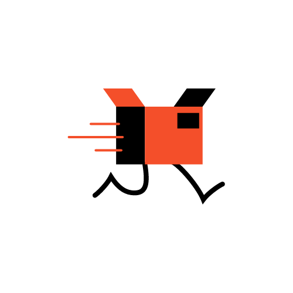

  
  <h1 align="center">C-</h1>
  
The Voltage package manager

# Voltage
Voltage is a package manager for JavaScript, Python, C, C++ with the soul purpose of sharing code easily in a ‘container’.

###### How to use
Use Voltage by adding a new file called  'package.toml'  then run Voltage and there you go! Easy and  Fast  right?
